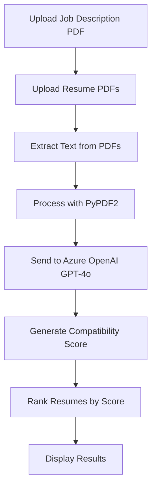

# 🤖 AI Resume Screener & Ranker

A lightweight, interactive web application built with **Streamlit** that leverages **GPT-4o via Azure OpenAI** to intelligently evaluate and rank multiple resumes against a provided job description. This AI-powered tool uses **LangChain** to generate semantic similarity-based scoring, helping recruiters and hiring managers streamline their candidate screening process.


## 📋 Table of Contents

- [Features](#-features)
- [How It Works](#-how-it-works)
- [Tech Stack](#-tech-stack)
- [Prerequisites](#-prerequisites)
- [Installation](#-installation)
- [Configuration](#-configuration)
- [Usage](#-usage)
- [Limitations](#-limitations)
- [Future Enhancements](#-future-enhancements)
- [Contributing](#-contributing)
- [Author](#-author)

## 🎯 Features

### Core Functionality
- 📄 **Job Description Upload**: Support for single PDF job description upload
- 📑 **Batch Resume Processing**: Upload and process up to 10 resume PDFs simultaneously
- 🤖 **AI-Powered Scoring**: Utilizes GPT-4o via Azure OpenAI for intelligent resume evaluation
- 🔢 **Quantitative Assessment**: Generates precise numeric scores (0-100) for each resume
- 📊 **Intelligent Ranking**: Automatically ranks resumes in descending order of job compatibility
- ⚡ **Real-time Processing**: Instant scoring feedback through intuitive Streamlit interface

### Advanced Features
- 🎯 **Semantic Matching**: Deep understanding of job requirements vs. candidate qualifications
- 🔄 **Batch Processing**: Efficient handling of multiple resumes with progress indicators
- 📈 **Performance Metrics**: Clear scoring methodology and ranking visualization
- 💻 **User-Friendly Interface**: Clean, responsive web interface built with Streamlit
- 🔒 **Secure Processing**: Local processing with secure API calls to Azure OpenAI

## 🧠 How It Works

### Processing Pipeline



### Detailed Workflow

1. **Document Upload**: Users upload one job description PDF and multiple resume PDFs (max 10)
2. **Text Extraction**: The application extracts raw text from all PDF files using PyPDF2
3. **AI Processing**: For each resume, LangChain's LLMChain sends a structured prompt to GPT-4o
4. **Semantic Analysis**: The LLM analyzes resume content against job requirements
5. **Score Generation**: Each resume receives a compatibility score from 0-100
6. **Ranking & Display**: Results are sorted and presented in descending order of relevance

### Scoring Methodology

The AI model evaluates resumes based on:
- **Skills Alignment**: Technical and soft skills match with job requirements
- **Experience Relevance**: Years and type of experience related to the role
- **Educational Background**: Degree requirements and certifications
- **Industry Knowledge**: Domain-specific experience and expertise
- **Achievement Indicators**: Quantifiable accomplishments and results

## 🛠 Tech Stack

| Component | Technology | Purpose | Version |
|-----------|------------|---------|---------|
| **Frontend/UI** | Streamlit | Interactive web interface | 1.28+ |
| **PDF Processing** | PyPDF2 | Text extraction from PDF files | 3.0+ |
| **AI/ML Engine** | Azure OpenAI (GPT-4o) | Natural language understanding and scoring | Latest |
| **LLM Framework** | LangChain | LLM integration and prompt management | 0.1+ |
| **Prompt Engineering** | ChatPromptTemplate | Structured prompt creation | - |
| **Environment Management** | python-dotenv | Configuration and secrets management | 1.0+ |
| **Language** | Python | Backend processing and logic | 3.8+ |

### Architecture Overview

```
┌─────────────────┐    ┌──────────────────┐    ┌─────────────────┐
│   Streamlit     │    │   LangChain      │    │  Azure OpenAI   │
│   Frontend      │◄──►│   LLM Chain      │◄──►│    GPT-4o       │
└─────────────────┘    └──────────────────┘    └─────────────────┘
         │                        │
         ▼                        ▼
┌─────────────────┐    ┌──────────────────┐
│     PyPDF2      │    │   Environment    │
│  Text Extractor │    │   Configuration  │
└─────────────────┘    └──────────────────┘
```

## 📋 Prerequisites

Before setting up the project, ensure you have:

- **Python**: Version 3.8 or higher
- **pip**: Latest version for package management
- **Azure OpenAI Account**: Access to GPT-4o model
- **Git**: For version control and repository cloning

## 🚀 Installation

### 1. Clone the Repository

```bash
git clone https://github.com/Raheelkhan-05/resume-screener.git
cd resume-screener
```

### 2. Create Virtual Environment (Recommended)

```bash
# Create virtual environment
python -m venv resume_screener_env

# Activate virtual environment
# On Windows:
resume_screener_env\Scripts\activate

# On macOS/Linux:
source resume_screener_env/bin/activate
```

### 3. Install Dependencies

```bash
pip install -r requirements.txt
```

### 4. Verify Installation

```bash
python -c "import streamlit, PyPDF2, langchain; print('All dependencies installed successfully!')"
```

## Configuration

### Azure OpenAI Setup

1. **Create Azure OpenAI Resource**:
   - Go to [Azure Portal](https://portal.azure.com/)
   - Create a new Azure OpenAI resource
   - Deploy a GPT-4o model

2. **Get API Credentials**:
   - Navigate to your Azure OpenAI resource
   - Go to "Keys and Endpoint" section
   - Copy the endpoint URL and API key

3. **Environment Configuration**:

Create a `.env` file in the project root directory:

```env
# Azure OpenAI Configuration
AZURE_OPENAI_API_BASE=https://your-endpoint.openai.azure.com/
AZURE_OPENAI_API_VERSION=2023-05-15
AZURE_OPENAI_API_KEY=your_api_key_here
AZURE_OPENAI_API_NAME=gpt-4o-deployment-name
```

### Environment Variables Reference

| Variable | Description | Required | Example |
|----------|-------------|----------|---------|
| `AZURE_OPENAI_API_BASE` | Azure OpenAI endpoint URL | Yes | `https://myai.openai.azure.com/` |
| `AZURE_OPENAI_API_VERSION` | API version | Yes | `2023-05-15` |
| `AZURE_OPENAI_API_KEY` | Authentication key | Yes | `your-secret-key` |
| `AZURE_OPENAI_API_NAME` | Deployment name | Yes | `gpt-4o` |

## 🎯 Usage

### Running the Application

1. **Start the Streamlit Server**:
```bash
streamlit run app.py
```

2. **Access the Application**:
   - Open your web browser
   - Navigate to `http://localhost:8501`
   - The application interface will load automatically

### Step-by-Step Usage Guide

#### Step 1: Upload Job Description
- Click on "Upload Job Description (PDF)"
- Select a single PDF file containing the job description
- Wait for the file to upload successfully

#### Step 2: Upload Resumes
- Click on "Upload Resumes (max 10 PDFs)"
- Select multiple resume PDF files (maximum 10)
- Ensure all files are uploaded before proceeding

#### Step 3: Process and View Results
- The system will automatically start processing once both uploads are complete
- Wait for the "Scoring resumes, please wait..." message to complete
- View the ranked results with scores for each resume

### Example Output

```
Ranked Resumes

1. john_doe_resume.pdf — Score: 87/100
2. jane_smith_resume.pdf — Score: 84/100
3. michael_johnson_resume.pdf — Score: 76/100
4. sarah_wilson_resume.pdf — Score: 72/100
5. david_brown_resume.pdf — Score: 68/100
```

### Best Practices

- **Job Description Quality**: Ensure JD is comprehensive and well-structured
- **Resume Format**: Use standard resume formats for best text extraction
- **File Size**: Keep PDF files under 10MB for optimal performance
- **Batch Size**: Process 5-10 resumes at a time for best results


## 🚧 Limitations

### Current Limitations

1. **File Format Support**:
   - Only supports PDF files
   - No support for DOCX, TXT, or other formats

2. **Batch Size**:
   - Limited to 10 resumes per processing batch
   - No support for larger batch processing

3. **Performance**:
   - LLM inference latency increases with file size
   - Processing time varies based on Azure OpenAI response times

4. **Text Extraction**:
   - Depends on PyPDF2's ability to extract text from PDFs
   - May struggle with image-based or complex formatted PDFs

5. **Scoring Methodology**:
   - Assumes LLM can accurately parse resume structure
   - No fine-tuning for specific industries or roles

6. **Language Support**:
   - Optimized for English language resumes and job descriptions
   - Limited support for other languages

### Technical Constraints

- **API Limits**: Subject to Azure OpenAI rate limits and quotas
- **Memory Usage**: Large PDFs may consume significant memory
- **Network Dependency**: Requires stable internet connection
- **Cost Considerations**: Each API call incurs Azure OpenAI charges

## 🚀 Future Enhancements

### Planned Features

#### Short-term
- [ ] **Detailed Scoring Breakdown**: Provide reasoning and explanation with scores
- [ ] **DOCX Support**: Add support for Microsoft Word document formats
- [ ] **Batch Export**: Enable downloading of ranked results as CSV/Excel
- [ ] **Custom Scoring Criteria**: Allow users to define specific evaluation parameters
- [ ] **Progress Indicators**: Better visual feedback during processing

#### Medium-term
- [ ] **Resume Parsing Enhancement**: Structured data extraction from resumes
- [ ] **Multi-language Support**: Support for resumes in different languages
- [ ] **Template Library**: Pre-built job description templates for common roles
- [ ] **Feedback Loop**: User feedback system to improve scoring accuracy
- [ ] **Integration APIs**: RESTful API for integration with other HR tools

#### Long-term
- [ ] **Machine Learning Pipeline**: Custom ML models for specific industries
- [ ] **Resume Database**: Persistent storage and management of candidate profiles
- [ ] **Advanced Analytics**: Comprehensive reporting and analytics dashboard
- [ ] **Mobile Application**: Native mobile app for on-the-go screening
- [ ] **Interview Scheduling**: Integration with calendar and interview tools


## 🤝 Contributing

We welcome contributions from the community! Here's how you can help improve the AI Resume Screener & Ranker:

### How to Contribute

1. **Fork the Repository**
   ```bash
   git fork https://github.com/Raheelkhan-05/resume-screener.git
   ```

2. **Create a Feature Branch**
   ```bash
   git checkout -b feature/amazing-feature
   ```

3. **Make Your Changes**
   - Follow the existing code style
   - Add tests for new features
   - Update documentation as needed

4. **Commit Your Changes**
   ```bash
   git commit -m 'Add some amazing feature'
   ```

5. **Push to Your Branch**
   ```bash
   git push origin feature/amazing-feature
   ```

6. **Open a Pull Request**
   - Provide a clear description of your changes
   - Include any relevant issue numbers
   - Add screenshots for UI changes

### Development Guidelines

- **Code Style**: Follow PEP 8 guidelines for Python code
- **Testing**: Add unit tests for new functionality
- **Documentation**: Update README and docstrings
- **Commit Messages**: Use clear, descriptive commit messages
- **Dependencies**: Minimize new dependencies when possible

### Areas for Contribution

- 🐛 **Bug Fixes**: Help identify and fix issues
- ✨ **New Features**: Implement items from the roadmap
- 📚 **Documentation**: Improve guides and API documentation
- 🧪 **Testing**: Add comprehensive test coverage
- 🎨 **UI/UX**: Enhance the user interface and experience
- 🔧 **Performance**: Optimize processing speed and efficiency


## 📊 Performance Metrics

### Benchmark Results

| Metric | Value | Notes |
|--------|-------|-------|
| **Average Processing Time** | 15-30 seconds | For 5 resumes |
| **Accuracy Rate** | ~85% | Based on manual validation |
| **File Size Limit** | 10MB per PDF | Recommended maximum |
| **Concurrent Users** | 1 | Single-user Streamlit app |
| **Memory Usage** | ~200MB | During active processing |


## 👨‍💻 Author

**Raheelkhan Lohani**

### About the Author
Passionate AI/ML engineer with expertise in natural language processing, full-stack development, and cloud technologies. Dedicated to building practical AI solutions that solve real-world problems in HR technology and recruitment automation.

---

<div align="center">

**⭐ If you found this project helpful, please consider giving it a star on GitHub! ⭐**

*Made with ❤️ for the recruitment community*

**[🚀 Try it now](https://github.com/Raheelkhan-05/resume-screener)**

</div>
